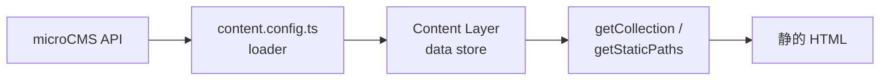

# Astro × microCMS でブログを作る — Content Loader の基礎

Astro の静的サイト生成と、microCMS のようなヘッドレス CMS を組み合わせると、「編集は CMS、配信は高速な静的 HTML」という役割分担がしやすくなります。Astro 5 以降では **Content Layer** と **Content Loader** により、リモートの API レスポンスをローカルの Markdown と同じ「コンテンツコレクション」として扱えるようになりました。

この記事では、Astro と microCMS でブログを組むときの全体像と、Content Loader の基礎を解説します。デプロイ手順や高度なキャッシュ設計には深入りせず、「なぜ loader が必要か」「どう書けば CMS の記事をページに出せるか」に焦点を当てます。

## 全体像

従来、Astro の Content Collections は主にリポジトリ内の Markdown / MDX を対象にしていました。Content Layer では、各コレクションに **loader**（データをどこからどう取り込むかを定義する仕組み）を付けます。loader がビルド時（および `astro dev` 起動時）にデータを集め、Astro がそれを内部の data store に保存します。ページ側ではこれまでどおり `getCollection()` などで取り出します。



| 管理方法 | データの置き場 | 取り込み方 |
| --- | --- | --- |
| ローカル Markdown | `src/content/` などのファイル | 公式の `glob` / `file` loader |
| microCMS など CMS | リモート API | カスタム loader（またはコミュニティ製 loader） |

どちらも最終的には「型付きのコレクション」になるため、一覧・詳細ページの書き方はほぼ共通です。違うのは **誰が・いつ・どこから中身を供給するか** です。

## 事前準備

### Astro プロジェクトと SDK

Astro プロジェクトを用意し、microCMS 公式の JavaScript SDK を入れます。

```bash
npm create astro@latest
npm install microcms-js-sdk
```

### microCMS 側

ブログ用途では、たとえば次のような API を用意します。

- **blogs**（リスト型）: `title` / `body`（リッチエディタ）など
- **tags**（リスト型、任意）: `title` / `slug` など。記事とコンテンツ参照で紐づける

管理画面で発行した **サービスドメイン** と **API キー** を、プロジェクトの環境変数に設定します。

```bash
# .env
MICROCMS_SERVICE_DOMAIN=your-service
MICROCMS_API_KEY=your-api-key
```

`.env` は Git に含めず、ローカルと CI / ホスティング側のそれぞれで設定してください。

## Content Collections と Content Loader の基礎

コレクションの定義は `src/content.config.ts`（または `.mjs` など）に書きます。中心になる API は次のとおりです。

- **`defineCollection`**: 1 つのコレクション（例: `blogs`）の定義
- **`loader`**: エントリの取得方法（必須）
- **`schema`**: Zod などによる形の定義（任意だが推奨）。型生成と実行時バリデーションに効く

```ts
import { defineCollection } from 'astro:content';
import { z } from 'astro/zod';
import { glob } from 'astro/loaders';

// ローカル Markdown の例（公式 loader）
const blog = defineCollection({
  loader: glob({ pattern: '**/*.md', base: './src/data/blog' }),
  schema: z.object({
    title: z.string(),
    description: z.string().optional(),
  }),
});

export const collections = { blog };
```

### loader の二形態

| 形態 | 概要 | 向いている用途 |
| --- | --- | --- |
| **関数型** | `async () => entries` のように配列（または id をキーにしたオブジェクト）を返す | API を一括取得してそのまま載せたいとき |
| **オブジェクト型** | `load({ store, ... })` を持ち、store を更新できる | 増分更新やキャッシュ制御など、より細かい制御が必要なとき |

microCMS の全件取得を載せるだけなら、関数型で十分なことが多いです。公式ドキュメントでは [Content Collections](https://docs.astro.build/en/guides/content-collections/) と [Content Loader API](https://docs.astro.build/en/reference/content-loader-reference/) に詳細があります。設計思想の背景は [Content Layer: A Deep Dive](https://astro.build/blog/content-layer-deep-dive/) も参考になります。

### 公式 loader とカスタム loader

- **`glob` / `file`**: ローカルファイル向けの組み込み loader
- **カスタム loader**: `fetch` や SDK で任意のソースからデータを返す関数（またはオブジェクト）

CMS 連携は「カスタム loader を自分で書く」か、「コミュニティが公開している loader パッケージを使う」かの選択になります。どちらでも、ページから見るインターフェースは Content Collections に揃います。

## microCMS 用カスタム loader の書き方

以下は、関数型 loader でリスト API を取り込む最小構成のイメージです。`microcms-js-sdk` の `createClient` と `getAllContents` を使い、endpoint 名だけ差し替えられるようにしています。

```ts
// src/content.config.ts
import { defineCollection } from 'astro:content';
import { z } from 'astro/zod';
import { createClient } from 'microcms-js-sdk';

const serviceDomain = import.meta.env.MICROCMS_SERVICE_DOMAIN;
const apiKey = import.meta.env.MICROCMS_API_KEY;

if (!serviceDomain || !apiKey) {
  throw new Error(
    'MICROCMS_SERVICE_DOMAIN and MICROCMS_API_KEY must be set in the environment.',
  );
}

const client = createClient({
  serviceDomain,
  apiKey,
});

const microCMSDateFields = {
  createdAt: z.string(),
  updatedAt: z.string(),
  publishedAt: z.string(),
  revisedAt: z.string(),
};

const tagSchema = z.object({
  id: z.string(),
  title: z.string(),
  slug: z.string(),
  ...microCMSDateFields,
});

/** endpoint を受け取り、その API の全件を返す loader を生成する */
const microCMSLoader = (endpoint: string) => {
  return async () => {
    const contents = await client.getAllContents({ endpoint });
    // microCMS の各コンテンツは id を持つため、そのままエントリとして使える
    return contents;
  };
};

const blogs = defineCollection({
  loader: microCMSLoader('blogs'),
  schema: z.object({
    title: z.string(),
    body: z.string(),
    tags: z.array(tagSchema).optional().default([]),
    ...microCMSDateFields,
  }),
});

const tags = defineCollection({
  loader: microCMSLoader('tags'),
  schema: tagSchema,
});

export const collections = { blogs, tags };
```

ポイントは次のとおりです。

1. **loader は「配列を返す非同期関数」でよい**  
   各要素に一意な `id` があれば、Astro がコレクションのエントリとして扱います（microCMS のコンテンツ ID がそのまま使えます）。
2. **schema は CMS のフィールドと揃える**  
   リッチエディタの本文は多くの場合 HTML 文字列です。コンテンツ参照で埋め込んだタグは、上記のようにネストしたオブジェクト配列としてスキーマに含めます。
3. **コレクションを分けてよい**  
   `blogs` と `tags` を別コレクションにすると、タグ一覧ページやフィルタが書きやすくなります。記事側の `tags` フィールドと、独立した `tags` API の両方を持つ構成もよくあります。

SDK の使い方の詳細は [microCMS JavaScript SDK](https://github.com/microcmsio/microcms-js-sdk) を参照してください。コミュニティには [microcms-astro-loader](https://github.com/morinokami/microcms-astro-loader) のような専用 loader もあります。自前実装とパッケージ利用は、要件とメンテナンス方針で選ぶとよいでしょう。

## ページでの利用

loader で取り込んだあとは、通常の Content Collections と同じです。

### 記事一覧

```astro
---
// src/pages/index.astro
import { getCollection } from 'astro:content';

const posts = (await getCollection('blogs')).sort(
  (a, b) =>
    new Date(b.data.publishedAt).valueOf() -
    new Date(a.data.publishedAt).valueOf(),
);
---

<ul>
  {
    posts.map((post) => (
      <li>
        <a href={`/blog/${post.id}/`}>{post.data.title}</a>
      </li>
    ))
  }
</ul>
```

`post.data` には schema で定義したフィールドが入り、`post.id` はエントリの ID（多くの場合 microCMS のコンテンツ ID）です。

### 記事詳細（動的ルート）

```astro
---
// src/pages/blog/[...slug].astro
import { type CollectionEntry, getCollection } from 'astro:content';

export async function getStaticPaths() {
  const posts = await getCollection('blogs');
  return posts.map((post) => ({
    params: { slug: post.id },
    props: post,
  }));
}

type Props = CollectionEntry<'blogs'>;
const post = Astro.props;
---

<article>
  <h1>{post.data.title}</h1>
  {/* リッチエディタの HTML をそのまま出す場合 */}
  <div set:html={post.data.body} />
</article>
```

`getStaticPaths` で全記事分のパスを事前に列挙するため、ビルド時に静的ページが生成されます。本文が HTML のときは `set:html` で出力します。XSS に注意し、信頼できる CMS の出力であることを前提にしてください。

コードブロックのシンタックスハイライトや、見出しからの目次生成などは、HTML をビルド時に加工する「応用」として後から足せます。コアの流れは「loader で取る → `getCollection` で読む → ページに渡す」までです。

## ビルド時取得であることの意味

この構成の Content Collections は、原則として **ビルド（および開発サーバー起動）時点のスナップショット** です。

- microCMS で記事を更新しても、サイトを再ビルドするまで本番の HTML には反映されない
- ホスティング側では、CMS の Webhook でビルドをキックする運用が一般的

一方、リクエスト時に最新を取りたい場合は、Astro の Live Collections などランタイム向けの仕組みが別途あります。本記事の範囲外ですが、「常に最新を SSR で取る」のか「静的に固めて CDN 配信する」のかで、loader の選び方やインフラが変わる、と覚えておくとよいです。

## まとめ

- Astro の Content Layer では、**loader がコンテンツの供給源**になる
- microCMS は SDK で全件取得する **カスタム loader** を `defineCollection` に渡すと、Markdown と同じく `getCollection` で扱える
- **schema** でフィールドを固定すると、型とバリデーションの両方で安心できる
- 一覧・詳細は既存の Collections / `getStaticPaths` の知識がそのまま活きる
- データはビルド時のスナップショットなので、更新反映には再ビルド（＋必要なら Webhook）が前提

Content Loader は、「ヘッドレス CMS の世界」と「Astro の Content Collections の世界」をつなぐ橋です。まずは関数型 loader と最小の一覧・詳細から始め、必要になったらタグ、画像最適化、Webhook 再ビルド、コミュニティ製 loader へと広げていくのがおすすめです。

### 次の一歩

- microCMS の Webhook で Vercel / Netlify などのビルドを自動実行する
- 公式・コミュニティの loader パッケージを試し、自前実装と比較する
- 画像は microCMS の画像 API や Astro の画像最適化と組み合わせる
- HTML 本文の見出し ID 付与、目次、コードハイライトなどの読みやすさ向上
