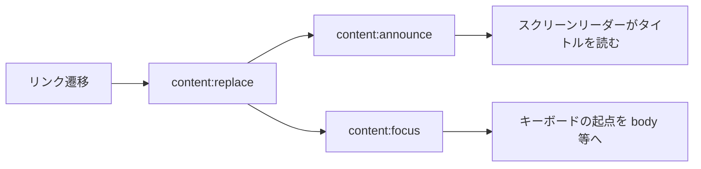

# swup Accessibility Plugin — AJAX 遷移でも読み上げとフォーカスを保つ

[swup](https://swup.js.org/getting-started/) は次のページを AJAX で取得し、コンテナだけ差し替えます。見た目はスムーズですが、スクリーンリーダー利用者にとっては「ページが変わった」ことが伝わりにくく、キーボード利用者にとってはフォーカスがどこにあるか分かりにくくなります。公式の [Accessibility Plugin](https://swup.js.org/plugins/a11y-plugin/)（`@swup/a11y-plugin`）は、その隙間を埋めるためのプラグインです。

この記事では、プラグインが何をするか、マークアップとオプションの決め方、そしてこのサイト（`@swup/astro` + Fragment）での関わり方をまとめます。導入の全体像は [Astro に swup を導入する](./astro-swup-page-transitions.md) を参照してください。

## なぜ必要か

通常のフルリロードでは、ブラウザが新しい文書を読み込み、スクリーンリーダーがタイトルを読み上げ、フォーカスも文書先頭に戻ります。swup の差し替えでは DOM の一部だけが入れ替わるため、その既定の挙動が起きません。

Accessibility Plugin が補うのは主に次の三点です。

| 機能 | 内容 |
| --- | --- |
| 訪問のアナウンス | 新しいページの見出し（またはタイトル）をスクリーンリーダーに読み上げる |
| フォーカスの復元 | コンテンツ差し替え後、既定では `body` にフォーカスを戻す（同一ページのアンカーはターゲットへ） |
| モーション低減 | `prefers-reduced-motion` があるとき、遷移アニメとアニメ付きスクロールをスキップする |

セマンティックなマークアップ（特に各ページの説明的な `h1`）があれば、追加の特別なマークアップなしでも動き始めます。



## `@swup/astro` では既定で有効

素の swup ではパッケージを入れてインスタンスに渡します。

```bash
npm install @swup/a11y-plugin
```

```js
import Swup from 'swup';
import SwupA11yPlugin from '@swup/a11y-plugin';

const swup = new Swup({
  plugins: [new SwupA11yPlugin()],
});
```

このサイトでは [`@swup/astro`](https://swup.js.org/integrations/astro/) を使っており、インテグレーション既定で Accessibility Plugin が含まれます。追加の `npm install` や `new SwupA11yPlugin()` は不要です。オプションを細かく変えたい場合は、Astro 側の設定で a11y 向けの値を渡すか、`globalInstance: true` で公開した `window.swup` からフックで調整します。

## マークアップの前提

プラグインは「きちんとした見出しがあるページ」を前提にしています。

```html
<body> <!-- 遷移後、既定ではここにフォーカス -->
  <header>Logo</header>
  <main>
    <h1>Page Title</h1> <!-- 読み上げ候補 -->
    <p>Lorem ipsum dolor sit amet</p>
  </main>
</body>
```

アナウンス時に探す優先順位は次のとおりです（最初に見つかったものを使う）。

1. 見出しの `aria-label`（例: `<h1 aria-label="About"></h1>`）
2. 見出しのテキスト（例: `<h1>About</h1>`）
3. 文書の `<title>`
4. ページ URL

表示上の見出しと、読み上げたい名前を分けたいときは `aria-label` が手軽です。

```html
<h1 aria-label="Homepage">Project Title</h1>
```

この例ではスクリーンリーダーには `Homepage` と伝わります。サイト名を大きく出したいヒーローでも、ページ識別は別文言にできます。

## フォーカスの扱い

ページ間遷移では、ブラウザのフルリロードに近い挙動としてフォーカスを `body` に戻します。同一ページ内のアンカーリンクでは、リンク先の要素にフォーカスします。

アンカー先は「セクション全体の大きなコンテナ」より、そのセクションを表す見出しやボタンなど、単一の説明的な要素を指すのが安全です。大きな箱をターゲットにすると、拡大表示ではスクロール位置が中央寄りになりやすく、スクリーンリーダーもコンテナ内を長く読み上げてしまうことがあります。

マウス操作ではフォーカスアウトラインが邪魔に感じることがある一方、キーボード操作では必須です。プラグインがフォーカスを当てた要素にもブラウザのアウトラインが出るため、次のように `:focus-visible` と組み合わせると両方に配慮しやすいです。

```css
:focus:not(:focus-visible) {
  outline: none;
}
```

## オプション

既定値のイメージは次のとおりです（[公式ドキュメント](https://swup.js.org/plugins/a11y-plugin/) 準拠）。

```js
{
  headingSelector: ['main h1', 'h1'],
  respectReducedMotion: true,
  autofocus: false,
  announcements: {
    visit: 'Navigated to: {title}',
    url: 'New page at {url}',
  },
}
```

| オプション | 意味 |
| --- | --- |
| `headingSelector` | 読み上げる見出しのセレクタ。配列なら先頭から優先（既定は `main` 内の `h1` を優先） |
| `respectReducedMotion` | OS のモーション低減設定を尊重するか |
| `autofocus` | 遷移後に `[autofocus]` へフォーカスするか。便利だがスクリーンリーダーでは副作用もあるので慎重に |
| `announcements` | 読み上げ文言。`{title}` / `{url}` を置換する |

多言語サイトでは、`html` の `lang` とキーを一致させたネストオブジェクトを渡せます。フォールバックは `*` です。

```js
{
  announcements: {
    'ja': {
      visit: '{title} に移動しました',
      url: '新しいページ: {url}',
    },
    'en-US': {
      visit: 'Navigated to: {title}',
      url: 'New page at {url}',
    },
    '*': {
      visit: '{title}',
      url: '{url}',
    },
  },
}
```

swup 本体は `lang` 属性を自動更新しません。言語切替があるサイトでは [Head Plugin](https://swup.js.org/plugins/head-plugin/) で `<html lang>` を同期するか、`content:replace` フックで自分で更新します。`@swup/astro` は head 更新が有効なことが多いですが、`lang` が意図どおり変わっているかは一度確認すると安心です。

## Visit オブジェクトとフック

プラグインは visit に `a11y` キーを足し、訪問ごとに挙動を変えられます。

```js
{
  a11y: {
    announce: 'Navigated to: About',
    focus: {
      selector: 'body',
      wait: true, // true なら visit:end まで待つ
    },
  },
}
```

| フィールド | 使い方 |
| --- | --- |
| `visit.a11y.announce` | 最終的な読み上げ文字列。`false` で無効化も可。中身は新ページ取得後に確定するため、変更は `content:announce` の直前が現実的 |
| `visit.a11y.focus` | フォーカス先セレクタとタイミング。`false` でフォーカス処理そのものを止める |

```js
swup.hooks.on('visit:start', (visit) => {
  if (someCondition()) {
    visit.a11y.focus = {
      selector: 'main',
      wait: false, // content:replace 直後にフォーカス
    };
  }
});

swup.hooks.before('content:announce', (visit) => {
  visit.a11y.announce = 'New page loaded';
});
```

追加フックは次の二つで、どちらも内部の `content:replace` のあとに走ります。

- `content:announce` — 新しいページタイトルのアナウンス
- `content:focus` — フォーカスの適用

プログラムから任意の文言を読み上げたいときは、インスタンスの `announce` メソッドを使います（`resolveUrl` などで「ページ遷移ではないが状態が変わった」とき向け）。

```js
swup.announce?.(`Filtered by ${myFilterString}`);
```

## このサイトでの関わり方

### Fragment 遷移ではフォーカスを残す

[Fragment Plugin の記事](./astro-swup-fragment-plugin.md) のとおり、タグ一覧の切り替えでは `#articles` だけ差し替え、タグナビは残します。Accessibility Plugin の既定だと遷移後に `body` へフォーカスが移るため、キーボードで Enter したタグリンクからフォーカスが外れます。

そのため Fragment ルールで `focus: false` を指定し、**その訪問については a11y のフォーカス移動を止めています**。

```js
// astro.config.mjs（要旨）
fragments: [
  {
    from: ['/', '/tags/:slug', '/tags/:slug/'],
    to: ['/', '/tags/:slug', '/tags/:slug/'],
    containers: ['#articles'],
    name: 'tag-filter',
    focus: false, // 押したタグリンクにフォーカスを残す
  },
],
```

記事詳細への通常遷移では、プラグイン既定どおりフォーカスとアナウンスが働きます。部分差し替えとフル遷移でフォーカス方針を分ける、というのがこのサイトのパターンです。

### モーション低減は二重に守る

Accessibility Plugin の `respectReducedMotion`（既定 `true`）は、OS 設定に応じて遷移アニメを止めます。このサイトではさらに、ヘッダーの Motion トグルと `visit.animation.animate = false`（`swup-motion.ts`）で、保存済みの好みも反映しています。

| レイヤ | 役割 |
| --- | --- |
| a11y プラグイン | `prefers-reduced-motion` を尊重（プラグイン既定） |
| サイトの Motion トグル | OS より優先する明示設定を `localStorage` に保存 |
| `visit:start` フック | トグル／OS 判定に応じて `visit.animation.animate = false` |

プラグインだけに頼ると「サイト側で Motion をオフにした」ケースが漏れることがあるため、フック側の制御を残しています。詳細は [ページ遷移の記事のモーション節](./astro-swup-page-transitions.md#アニメーション低減とコントロール-ui) を参照してください。

## 実装チェックリスト

1. 各ページに説明的な `h1`（必要なら `aria-label`）があるか
2. `@swup/astro` 利用時は a11y が無効化されていないか
3. フォーカスアウトラインを `:focus-visible` 前提で潰しすぎていないか
4. 同一ページ内リンクのターゲットが大きすぎるコンテナになっていないか
5. Fragment など「フォーカスを残したい遷移」に `focus: false` や `visit.a11y.focus` を検討したか
6. 多言語なら `announcements` と `html[lang]` の対応を確認したか
7. `autofocus: true` にするなら、スクリーンリーダーへの影響を検証したか

## まとめ

- AJAX 差し替えは便利だが、**読み上げ・フォーカス・モーション低減**はブラウザのフルリロードほど自動では揃わない
- Accessibility Plugin はその三点を補い、セマンティックな `h1` があれば基本設定で動き始める
- アナウンスは見出し → `title` → URL の順。表示と読み上げを分けるなら `aria-label`
- フォーカスは既定で `body`。部分 UI を残す Fragment では `focus: false` などで上書きする
- モーション低減はプラグイン既定に加え、サイト独自トグルがあるなら `visit.animation.animate` も制御する

公式のフィードバック窓口もあるとおり、アクセシビリティは「入れて終わり」になりにくい領域です。実機の VoiceOver などで「タグ切替」「記事への遷移」「ブラウザバック」を一度ずつ試し、読み上げとフォーカス位置が期待どおりかを確認するのがいちばん確実です。

### 次の一歩

- [Astro に swup を導入する](./astro-swup-page-transitions.md)
- [Fragment Plugin でタグ一覧だけを差し替える](./astro-swup-fragment-plugin.md)
- [Accessibility Plugin 公式ドキュメント](https://swup.js.org/plugins/a11y-plugin/)
- [Controlling focus / Styling focus](https://swup.js.org/plugins/a11y-plugin/#styling)（フォーカス可視化の考え方）
