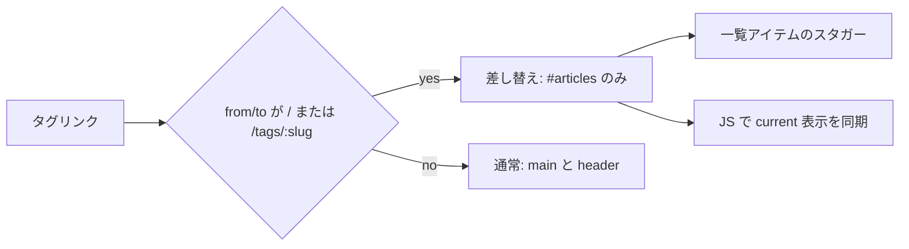

# Astro × swup Fragment Plugin — タグ一覧だけを差し替える

[前回](./astro-swup-page-transitions.md) では `@swup/astro` でページ遷移そのものを導入しました。デフォルトでは `main`（とこのサイトでは `header`）全体が差し替わるため、タグを切り替えるたびにヘッダーやタグナビまでフェードします。実際に変わっているのは記事一覧だけなのに、画面全体が「ページ移動した」ように見える状態です。

[Fragment Plugin](https://swup.js.org/plugins/fragment-plugin/) は、URL の組み合わせごとに「今回はどのコンテナだけ差し替えるか」をルールで指定できます。公式デモの [Characters フィルタ](https://swup-fragment-plugin.netlify.app/characters/) と同じ発想で、このサイトのタグ一覧に適用した内容をまとめます。

## 何を解決したかったか

トップ（`/`）とタグページ（`/tags/:slug/`）は、どちらも次の二段構成です。

1. 上: タグナビ（`TagsList`）
2. 下: 記事一覧（`ArticlesList`）

タグをクリックすると URL は変わりますが、ナビの並び自体はほぼ同じで、変わるのは一覧の中身と「いま選んでいるタグ」の表示です。ここを fragment にすると、次の体験になります。

- タグナビは DOM ごと残る（ちらつかない）
- 記事一覧だけ差し替わってフェード／スタガーする
- スクロール位置がリセットされない（Fragment の既定）
- キーボードで Enter したタグリンクにフォーカスが残る



## `@swup/astro` での有効化

追加パッケージは不要です。`@swup/astro` が依存として `@swup/fragment-plugin` を含んでおり、`fragments` オプションを渡すと有効になります。

```js
// astro.config.mjs
swup({
  containers: ['main', 'header'],
  globalInstance: true,
  theme: 'fade',
  fragments: [
    {
      from: ['/', '/tags/:slug', '/tags/:slug/'],
      to: ['/', '/tags/:slug', '/tags/:slug/'],
      containers: ['#articles'],
      name: 'tag-filter',
      focus: false,
    },
  ],
}),
```

| キー | 役割 |
| --- | --- |
| `from` / `to` | 直前 URL と次 URL。どちらもマッチしたときだけ fragment 扱い |
| `containers` | 差し替える要素。**ID セレクタのみ**（`#articles` は可、`.articles` は不可） |
| `name` | ルール名。必要なら `to-tag-filter` のようなクラスでスタイルを絞れる |
| `focus` | Accessibility Plugin のフォーカス移動を制御。`false` でトリガー要素にフォーカスを残す |

ルールにマッチしない遷移（記事詳細 ↔ トップなど）は、従来どおり `containers: ['main', 'header']` が使われます。

末尾スラッシュの有無でマッチが外れることがあるため、`/tags/:slug` と `/tags/:slug/` の両方を書いています。トップは `/` を `from` / `to` に含め、ホーム ↔ タグも同じ fragment にしています。

## マークアップ: 差し替え対象に ID を付ける

Fragment の `containers` は ID 必須です。記事一覧側に `id="articles"` を付けます。

```astro
<!-- src/components/ArticlesList.astro -->
<section id="articles" class:list={['articles', className]}>
  <!-- ... -->
  <ul>
    {posts.map((post, index) => (
      <li
        class="article-item border-b border-border-muted"
        style={`transition-delay: ${index * 0.1}s`}
      >
        <!-- 記事リンク -->
      </li>
    ))}
  </ul>
</section>
```

タグナビにも `id="tags"` を付けていますが、今回のルールでは差し替えません。後述の「選択中表示の同期」用のフックとして使います。

ポイントは次のとおりです。

- fragment 要素は、通常の swup コンテナ（ここでは `main`）の**内側**にある必要がある
- 新旧ページの両方に同じ ID が存在しないと、そのルールはスキップされる
- ブログ詳細の関連記事など、同じ `ArticlesList` を使う箇所にも `id="articles"` が付くが、ルールの URL がタグ／ホームに限定されているため副作用はない

## タグナビを残す設計と current の同期

公式デモでは、フィルタ UI ごとひとつのコンテナ（`#characters-list`）に入れて差し替えています。見た目はリストだけ動いているように見えますが、実際はフィルタも HTML ごと入れ替わっています。

このサイトでは「タグ一覧は DOM ごと残したい」ので、差し替えは `#articles` だけにしました。その結果、SSR 時点で付いていた `.current` / `aria-current` は、タグをクリックしても自動では更新されません。URL を見てクライアント側で同期します。

```ts
// src/scripts/tags-current.ts
function syncCurrentTag() {
  const nav = document.querySelector('#tags nav[aria-label="Tags"]');
  if (!(nav instanceof HTMLElement)) return;

  const currentSlug =
    window.location.pathname.match(/^\/tags\/([^/]+)\/?$/)?.[1] ?? null;

  for (const link of nav.querySelectorAll<HTMLAnchorElement>('a.tag-link')) {
    const linkSlug = link.pathname.match(/^\/tags\/([^/]+)\/?$/)?.[1] ?? null;
    const isCurrent = currentSlug !== null && linkSlug === currentSlug;

    link.classList.toggle('current', isCurrent);
    if (isCurrent) {
      link.setAttribute('aria-current', 'page');
    } else {
      link.removeAttribute('aria-current');
    }
  }
}

syncCurrentTag();
document.addEventListener('astro:page-load', syncCurrentTag);
```

`@swup/astro` は遷移後に `astro:page-load` をディスパッチするため、初回表示と fragment 遷移の両方で同じ関数を回せます。スクリプトは `BaseHead` から読み込み、差し替えコンテナの外に置いて永続させます。

## アニメーション: コンテナではなく項目を動かす

Fragment 訪問では、アニメーション用クラス（`is-changing` / `is-animating` / `is-leaving`）が `#articles` に付きます。一覧全体を消すのではなく、各 `.article-item` の opacity をスタガーで変えます。

```css
#articles.is-changing {
  --duration-leave: 150ms;
  --duration-enter: 400ms;
  transition-duration: var(--duration-enter);
}
#articles .article-item {
  transition-property: opacity;
  transition-duration: 400ms;
  transition-timing-function: cubic-bezier(0.23, 1, 0.32, 1);
}
#articles.is-animating .article-item {
  opacity: 0;
}
```

`transition-delay` はマークアップ側で `index * 0.1s` を付けています。ここでハマりやすいのが、**transition を `#articles.is-changing .article-item` にだけ書いていると、swup がクラスを外した時点で後ろの項目の delay が無効になる**ことです。transition 自体は `.article-item` に常時持たせ、opacity の切り替えだけを `is-animating` に任せるとうまくいきます。

モーション低減時は既存の `html[data-motion='reduce']` で duration をほぼゼロにしています。`visit.animation.animate = false`（`swup-motion.ts`）も fragment 訪問に効きます。

## フォーカスをタグリンクに残す

Accessibility Plugin は遷移後にフォーカスを `body` などへ移します。タグナビを残しているのにフォーカスだけ奪われると、キーボード操作で「いま押したリンク」から外れてしまいます。

Fragment ルールの `focus: false` は、その訪問について a11y のフォーカス移動を止めます。`#tags` は差し替わらないため、クリック／Enter した `<a>` にフォーカスが残ります。

```js
{
  containers: ['#articles'],
  name: 'tag-filter',
  focus: false,
}
```

記事詳細など通常遷移では、これまでどおり a11y プラグインがフォーカスを扱います。

## フル遷移でトップに戻ったときのスタガー

記事詳細 → トップは fragment ルールにマッチしないため、`main` 全体のフェードになります。このとき `#articles` には fragment 用クラスが付かないので、項目スタガーも自動では走りません。

そこで `page:view` フックで、ホームへのフル遷移のときだけ同じスタガーを JS から再生します。

```ts
// src/scripts/articles-home-stagger.ts（要旨）
swup.hooks.on('page:view', (visit) => {
  if (visit.fragmentVisit) return; // fragment 側は CSS に任せる
  playHomeArticlesStagger();       // 内部で pathname === '/' を確認
});
```

実装上の注意です。

- `@swup/astro` の `reloadScripts` によりスクリプトが再実行されることがある。`window` 上のフラグでフック二重登録を防ぐ
- `astro:page-load` と「初回スキップ」フラグだけに頼ると、再実行のたびに初回扱いになりスタガーが毎回スキップされる
- 再生時はいったん即時非表示（`transition: none`）してから `is-home-stagger-active` でフェードインすると、退場アニメが混ざらない

## サイドボーダーが消えないようにする（関連実装）

`main` に左右ボーダーを付けていると、フル遷移のフェードでボーダーごと消えます。Fragment 自体の話ではありませんが、遷移体験とセットで直しています。

swup の差し替え対象外に `.site-frame` を置き、絶対配置の左右線だけを常時表示します。`Header` コンポーネント内の `header` 要素の外に置くと、`containers: ['header']` の差し替え後も残ります（`site-controls` と同じパターンです）。

## 実装チェックリスト

1. `fragments` に `from` / `to` / `containers` を書いたか（ID のみ、末尾スラッシュゆれを含むか）
2. 新旧ページの両方に `#articles` があるか
3. タグナビを残すなら、`current` / `aria-current` を URL 同期するスクリプトがあるか
4. スタガー用の `transition` がクラス除去後も生きているか
5. キーボード操作用に `focus: false`（または適切な `focus` セレクタ）を検討したか
6. フル遷移で同じ見た目が欲しい経路に、フックでの補完があるか
7. `prefers-reduced-motion` / サイトの Motion トグルと矛盾しないか

## まとめ

- Fragment Plugin は「フィルタ UI ＋結果リスト」のような、**ページの一部だけが変わる遷移**向け
- `@swup/astro` では `fragments` 配列を渡すだけで有効化できる
- 差し替えを `#articles` に限定し、タグナビは残す／選択状態は JS で同期する、という分け方がこのサイトでは扱いやすい
- アニメはコンテナ全体よりリスト項目単位のほうが、公式デモに近い「一覧だけ動く」印象になる
- a11y のフォーカス移動と、フル遷移時のアニメ補完は、ルール外の体験として別途整える

関連ドキュメントは次のとおりです。

- [Fragment Plugin（公式）](https://swup.js.org/plugins/fragment-plugin/)
- [Astro 向け swup 導入メモ](./astro-swup-page-transitions.md)
- [Fragment デモ: Characters](https://swup-fragment-plugin.netlify.app/characters/)
