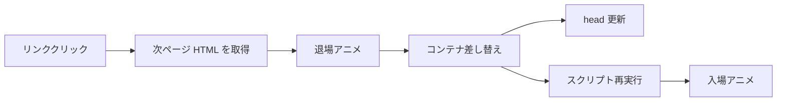
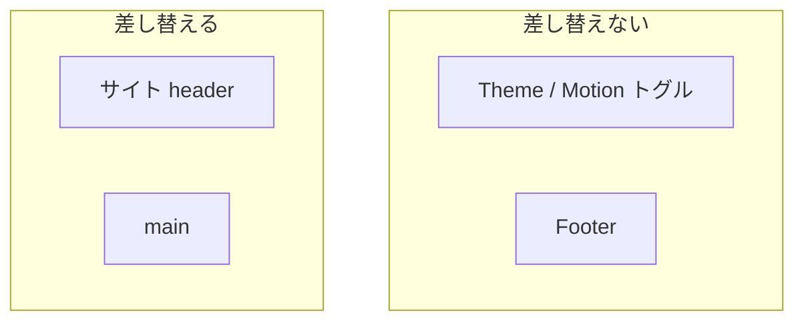

# Astro に swup を導入する — ページ遷移をスムーズにする

Astro はページごとに HTML を返すマルチページ構成が基本です。表示は速い一方、リンクのたびにブラウザがフルリロードするため、単一ページアプリのような「画面がつながって動く」感は出にくいことがあります。[swup](https://swup.js.org/getting-started/) は、サーバーが描画した HTML をクライアント側で取得し、指定した領域だけ差し替えつつ遷移アニメーションをつけるライブラリです。公式の [Astro 向けインテグレーション](https://swup.js.org/integrations/astro/)（`@swup/astro`）を使うと、設定ファイルに足すだけで導入できます。

この記事では、`@swup/astro` の最小導入から、実際のサイトで必要になったコンテナ設計・スクリプト再初期化・アニメーション低減までを、導入後に直した内容も含めて解説します。

## swup と Astro の役割分担

Astro はビルド時（またはリクエスト時）にページ HTML を用意します。swup はその HTML をリンククリック時に取得し、次のようなライフサイクルを回します。



| 担当 | 役割 |
| --- | --- |
| Astro | ルーティング、コンテンツ、静的 HTML の生成 |
| swup | クライアントでの取得・キャッシュ・差し替え・遷移アニメ・アクセシビリティ補助 |

SPA フレームワークに載せ替えるのではなく、「いまの MPA のまま体感だけなめらかにする」のがポイントです。公式の Getting Started でも、最小のマークアップとテーマで始められる設計になっています。

## `@swup/astro` のインストールと最小設定

パッケージを入れ、`astro.config.mjs` の `integrations` に追加します。

```bash
npm install @swup/astro
```

```js
// astro.config.mjs
import { defineConfig } from 'astro/config';
import swup from '@swup/astro';

export default defineConfig({
  integrations: [swup()],
});
```

これだけで、インテグレーションが各ページにクライアントスクリプトを注入します。デフォルトでは次のような挙動になります。

- **差し替え対象**: 最初の `<main>`（`containers: ['main']`）
- **テーマ**: `fade`
- **その他**: プリロード、キャッシュ、アクセシビリティプラグイン、`head` 更新、スクリプト再実行などが有効

セマンティックに `<main>` で本文を囲っていれば、マークアップ側の特別な `id="swup"` は必須ではありません。設定を足したら開発サーバーを再起動し、リンク遷移時にフルリロードせず Network 上でページ HTML が取得されているかを確認すると安心です。

## 差し替えコンテナの設計

デフォルトの `main` だけでは足りないことがあります。たとえばサイトタイトルを、ホームでは `<h1>`、それ以外ではホームへのリンクにする Header がある場合、Header が `<main>` の外にあると **遷移後も古い Header が残ります**。

```js
swup({
  containers: ['main', 'header'],
  theme: 'fade',
});
```

swup は各セレクタに対して `querySelector`（先頭の一致）で要素を探し、新旧ページ間で置き換えます。記事ページに `.article-header` など別の `<header>` があっても、ドキュメント先頭のサイト用 `<header>` だけがこのセレクタの対象になります。記事ヘッダーは `<main>` 側の差し替えに含まれます。



固定配置のテーマ切替ボタンなどは Header の外に置き、コンテナから外すと状態を保持しやすいです。逆に、ページごとに中身が変わる要素は `containers` に入れるか、`<main>` 内に収めるかを意識してレイアウトを切ると安全です。

## ハマりどころ: ページ固有スクリプトが動かない

Astro の `<script>` はコンポーネントから抜き出され、多くの場合 **差し替えコンテナの外**（`head` や `body` 末尾付近）に配置されます。記事詳細だけが持つ「Contents ボタンをスクロールで表示する」ような初期化がレイアウト内の `<script>` にだけあると、次の問題が起きます。

1. 一覧ページにはそのスクリプトが存在しない
2. swup は `main` / `header` だけを差し替える
3. 記事 HTML 内の UI は来るが、初期化コードは読み込まれない
4. ボタンが `display: none` のまま、など「動かない」状態になる

`@swup/astro` は遷移後に `astro:page-load` をディスパッチします。対策は次の組み合わせが扱いやすいです。

- 初期化ロジックを **全ページで読み込む共有スクリプト**（例: `BaseHead` から import）に移す
- 初回実行に加え、`document.addEventListener('astro:page-load', init)` で再初期化する
- リスナーや `IntersectionObserver` は `AbortController` などで破棄してから張り直す

```ts
// イメージ: 記事メニューの再初期化
function initArticleMenu() {
  // 前回分を abort してから、現在の DOM を querySelector
}

initArticleMenu();
document.addEventListener('astro:page-load', initArticleMenu);
```

「そのページにしかないスクリプト」は swup と相性が悪い、と覚えておくとよいです。永続 UI 用のスクリプトも共有側に寄せ、遷移のたびに DOM の有無を見て早期 return する形に揃えると保守しやすくなります。

## アニメーション低減とコントロール UI

動きが苦手な利用者向けに、OS の `prefers-reduced-motion` を尊重し、さらにサイト側でオン／オフできると安心です。swup では訪問開始時にアニメを切るのが定石です。

```js
// globalInstance: true で window.swup を公開してから
swup.hooks.on('visit:start', (visit) => {
  if (window.__motionPreference?.prefersReduced()) {
    visit.animation.animate = false;
  }
});
```

`@swup/astro` では `globalInstance: true` を渡し、初期化完了後（idle 後）にフックを登録します。設定例は次のとおりです。

```js
swup({
  containers: ['main', 'header'],
  globalInstance: true,
  theme: 'fade',
});
```

設定の流れは次のように整理できます。

| 入力 | 反映 |
| --- | --- |
| `prefers-reduced-motion: reduce`（未保存時） | `html[data-motion="reduce"]`、遷移アニメなし |
| ヘッダーのトグルで明示指定 | `localStorage` に保存し、OS 設定より優先 |
| トグルで Motion に戻す | アニメあり（保存済みの意図を維持） |

コントロール UI はアイコンボタンにし、ホバー／フォーカスでツールチップ（`aria-label` と同じ文言）を出すと、狭いヘッダーでも操作内容が伝わります。タッチしやすいよう **最小 40×40px** 程度を確保し、フォーカス表示はアウトラインではなく背景と文字色の反転だけにする、といった細部も一緒に整えるとサイト全体のトーンと揃います。CSS 側では `html[data-motion="reduce"]` で UI トランジション時間を短くするなど、ページ遷移以外の動きも揃えられます。

## テーマの切り替え

公式テーマは主に次の三つです。`astro.config.mjs` の `theme` を変えるだけで試せます。

| 値 | 印象 |
| --- | --- |
| `'fade'` | フェード。無難で本文サイト向き |
| `'slide'` | 左右スライド |
| `'overlay'` | オーバーレイ。`['overlay', { direction: 'to-right' }]` のように方向指定も可能 |

カスタム CSS で独自アニメにする場合は `theme: false` とし、コンテナにアニメ用クラスを付けてスタイルを書きます。アニメ不要でキャッシュやプリロードだけ欲しい場合は、`theme: false` と `animationClass: false` の組み合わせもドキュメントにあります。

ブログやドキュメントサイトでは、派手さより読みやすさ優先で `fade` に戻す選択もよくあります。低減設定と組み合わせておけば、動きを好む人にはフェード、苦手な人には即時差し替え、と分岐できます。

## まとめ

- **`@swup/astro`** を `integrations` に足すと、Astro の MPA にページ遷移・キャッシュ・プリロードを足せる
- **ページごとに姿が変わる要素**（例: サイト Header）は `containers` に含める。固定 UI は外に出す
- **ページ固有の `<script>` は遷移後に来ない**ことがある。共有スクリプト + `astro:page-load` で再初期化する
- **`prefers-reduced-motion` と手動トグル**で `visit.animation.animate = false` にすると、アクセシビリティと好みの両方に応えやすい
- テーマは `fade` / `slide` / `overlay` を設定だけで切り替えられる

導入チェックリストは次のとおりです。

1. `npm install @swup/astro` と `swup({ ... })` を追加したか
2. 差し替えたい要素がすべて `containers`（またはその内側）にあるか
3. クライアント初期化が全ページで読み込まれ、`astro:page-load` でも動くか
4. 低減モーション時に遷移が止まっているか
5. テーマとコントロール UI がサイトのトーンに合っているか

swup は「Astro の出力を壊さずに、遷移体験だけを足す」ための道具です。まずは `swup()` のデフォルトで動かし、Header の食い違いやスクリプトの沈黙といった **実サイト特有の隙間** を一つずつ埋めていくのが、いちばん確実な進め方です。

### 次の一歩

- [swup の Hooks / Visit](https://swup.js.org/lifecycle/hooks/) で遷移中のスクロールやアナリティクス送信を制御する
- [Accessibility Plugin で読み上げとフォーカスを整える](./astro-swup-a11y-plugin.md)
- [Fragment Plugin でタグ一覧だけを差し替える](./astro-swup-fragment-plugin.md)
- Astro View Transitions との使い分け（併用は避け、どちらかに寄せる）をチームで決める
